# Отчет по разработке модели распознавания эмоций

## 1. Выбор датасета

Для разработки модели распознавания эмоций был выбран датасет FER-2013. Данные состоят из черно-белых изображений лиц размером 48x48 пикселей. Лица автоматически зарегистрированы таким образом, чтобы лицо было примерно по центру и занимало примерно одинаковое количество пространства на каждом изображении.

Задача заключается в классификации каждого лица на основе показанной эмоции на лице в одну из семи категорий:
- 0=Злость
- 1=Счастье
- 2=Грусть
- 3=Удивление
- 4=Нейтральность

Обучающий набор состоит из 28 709 примеров, а публичный тестовый набор состоит из 3 589 примеров.

Скачать датасет можно с Kaggle по ссылке: [FER-2013](https://www.kaggle.com/datasets/msambare/fer2013)

## 2. Выбор архитектуры модели

| Архитектура       | Показатель качества на обучающем датасете | Показатель качества на тестовом датасете |
|-------------------|----------------------------------------|----------------------------------------|
| ResNet            | 0.7549                                 | 0.6133                              |
| ConvolutionalNN   | 0.6231                                 | 0.5547                              |

Как видно из таблицы, для сравнительного анализа были выбраны две архитектуры нейронных сетей:

### - Архитектура ResNet

ResNet - это архитектура глубоких сверточных нейронных сетей, которая была представлена в 2015 году и получила большое внимание в области компьютерного зрения. Она разработана исследователями из Microsoft Research.

В файле `ResNet.py` создается модель ResNet-50 с входным изображением размером 48x48 пикселей и 5 классами для распознавания эмоций. Архитектура состоит из сверточных блоков и блоков идентичности, которые обеспечивают глубину сети и улучшают производительность. Модель включает в себя сверточные слои, слои пакетной нормализации, функции активации ReLU и глобальное усреднение перед полносвязным слоем для классификации.

В нижеприведенном графике отображено изменение точности модели и функции потерь на тестовых данных.

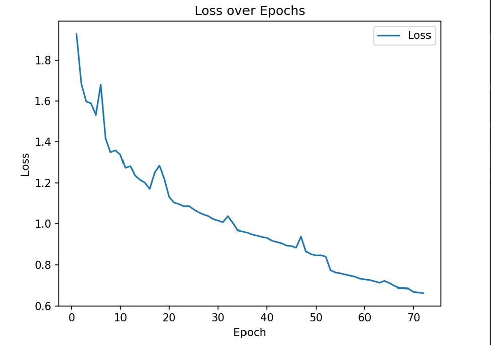
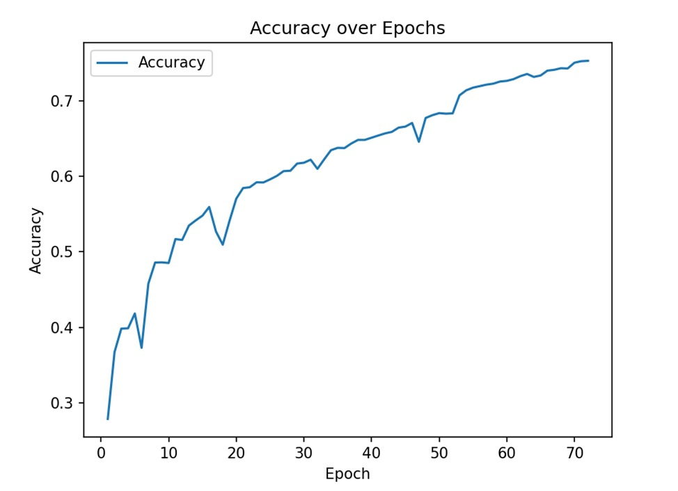

Как видно из графиков, после 72 эпох точность модели превысила 75%, а функция потерь уменьшилась до значения 0.66.

### - Архитектура ConvolutionalNN

ConvolutionalNN - это сверточная нейронная сеть (Convolutional Neural Network, CNN). Она состоит из нескольких сверточных слоев, слоев пулинга, слоев нормализации пакетов (Batch Normalization), слоев отсева (Dropout) и полносвязных слоев.

В файле `ConvNN.py` создается архитектура сверточной нейронной сети.

В нижеприведенном графике отображено изменение точности модели и функции потерь на тестовых данных.

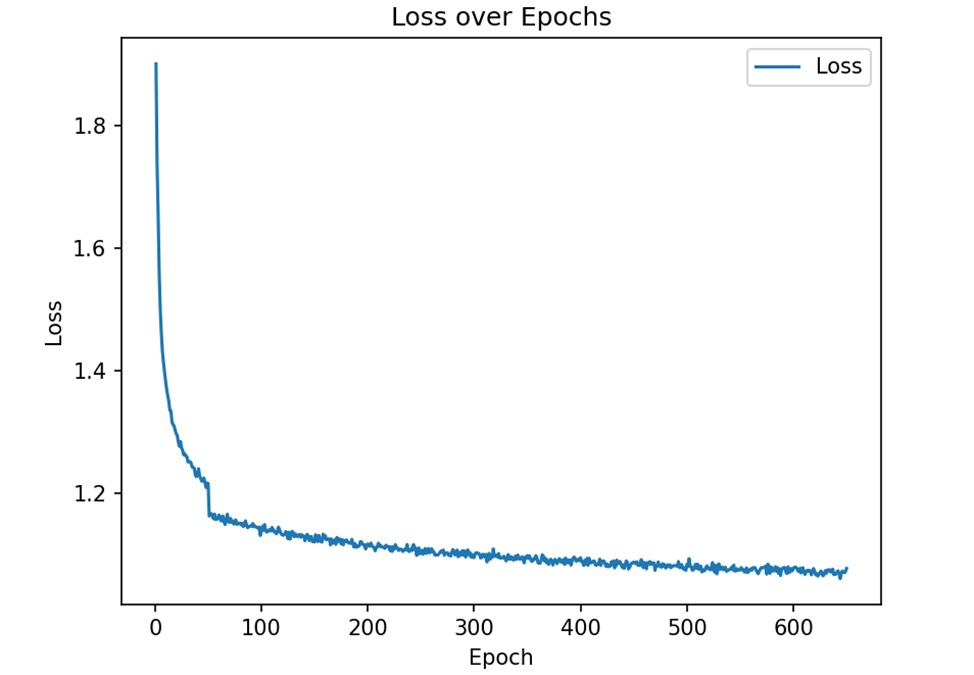
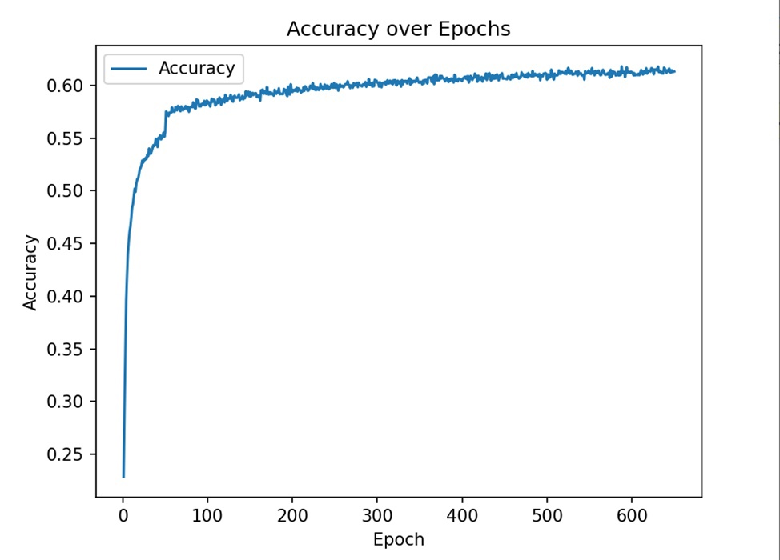

Первая архитектура (ResNet-50) достигла большей точности после 70 эпох, чем вторая архитектура за 650 эпох. Это объясняется тем, что ResNet-50 имеет более сложную и продуманную структуру. Вторая архитектура, как видно из графика, также показывает рост и стабильность в показателях, но результаты слабее и достигаются медленнее.

Итогом эксперимента я считаю выбор первой архитектуры (ResNet-50) в качестве основной и ее дальнейшее дообучение.

### - Дообучение модели ResNet
Ниже представлены результаты обучения модели ResNet спустя еще 125 эпох:
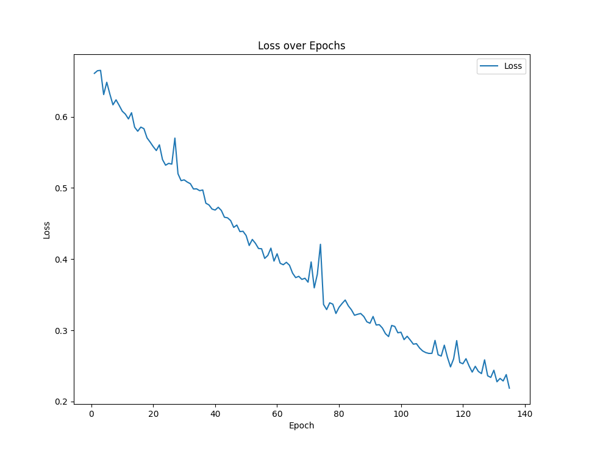
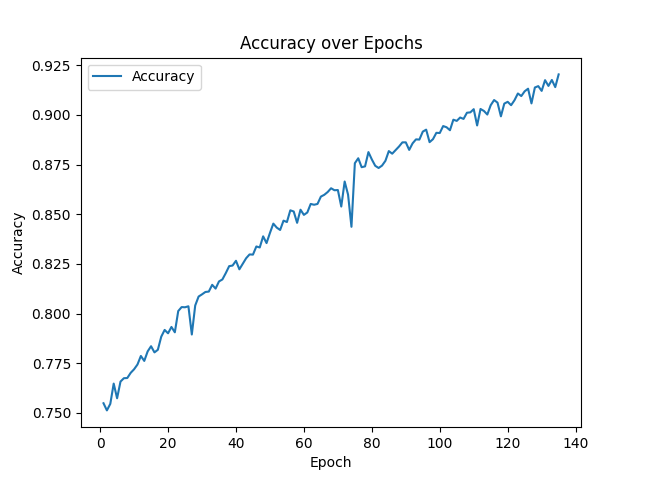

Как видно из графиков точность модели достигла 92%. Функция потерь уменьшалась и достигла значения 0.22.

Ниже представлено несколько изображений из тренировочной выборки и предсказание обученной модели по ним:

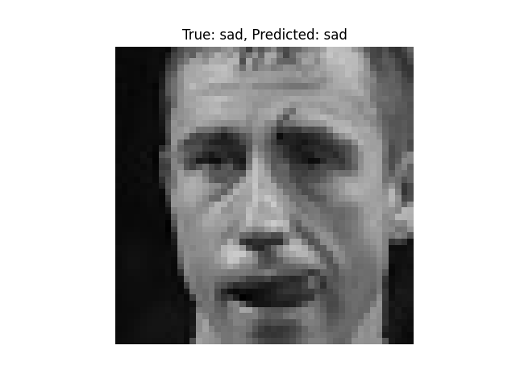

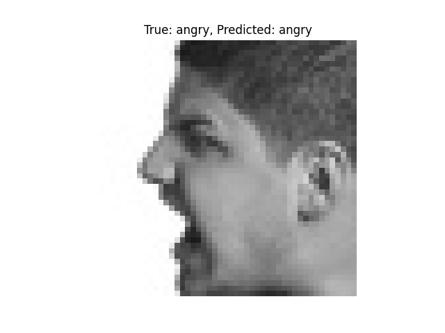

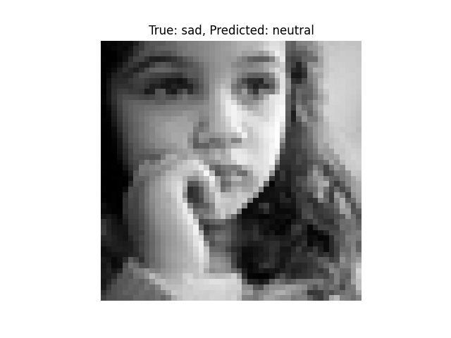

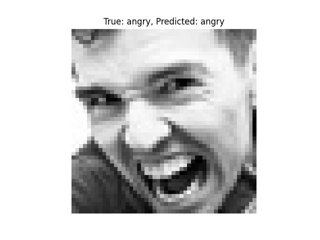

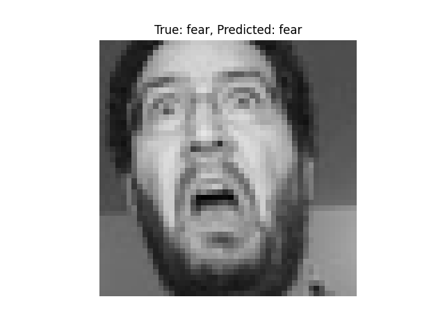

Однако, на тестовой выборке значение ошибки достигает 35 процентов, что свидетельствует о переобучении модели. В связи с этим нужно принять меры по ее улучшению.

### - Улучшение модели ResNet
Для улучшения модели я предпринял несколько шагов:
- Балансировка датасета
- Добавление метода Dropout для решения проблемы переобучения модели
- Использование метода адаптивного изменения скорости обучения ReduceLROnPlateau для выбора оптимальной скорости обучения

Я обучил модель заново и ее точность на тестовых данных действительно улучшилась. Теперь она достигла 75%
